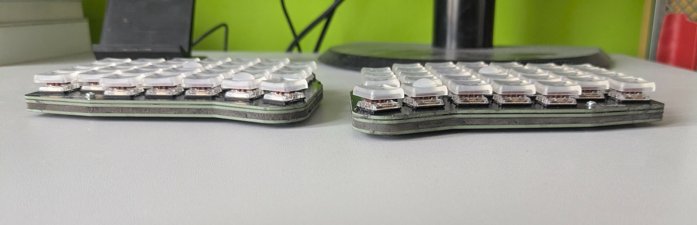
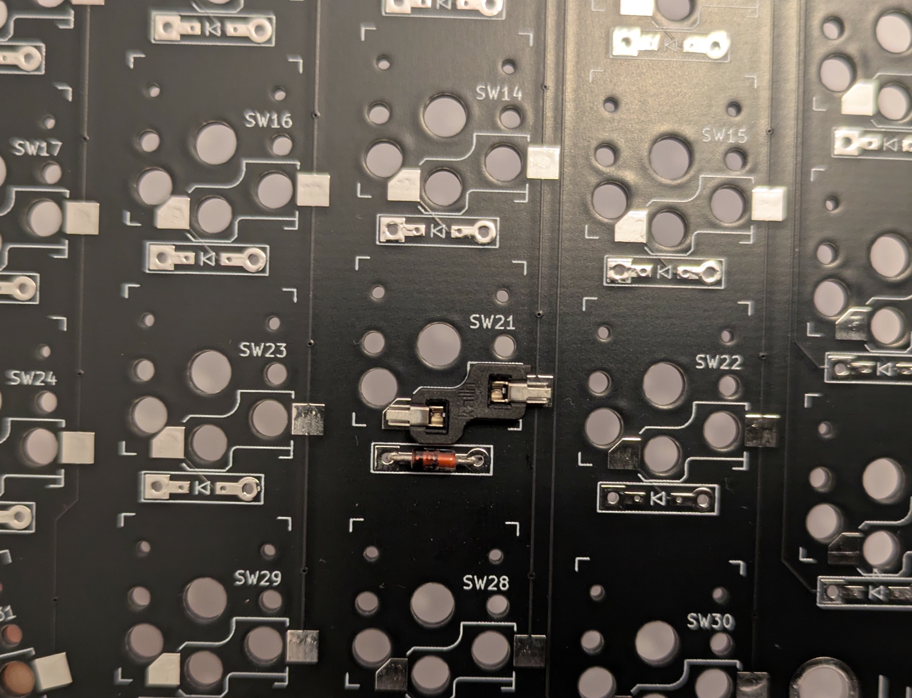
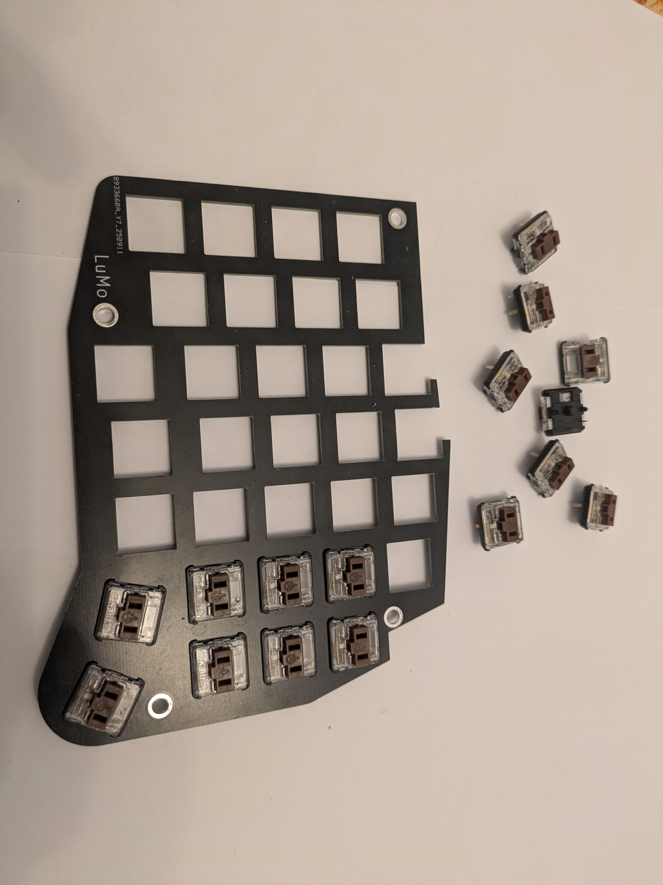
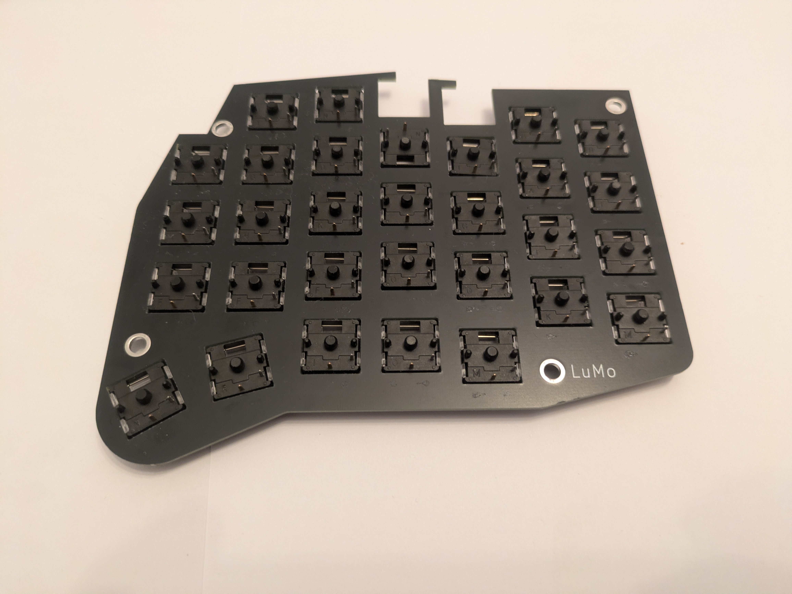
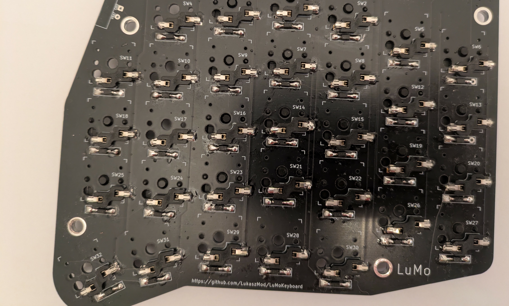
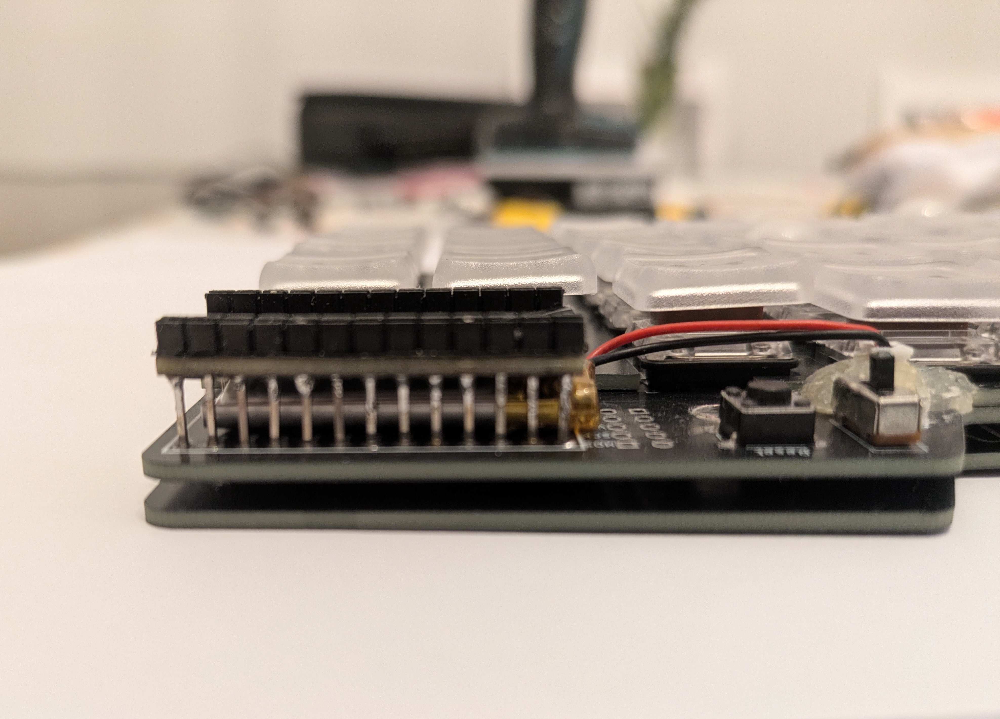

# LuMoKeyboard
Is is repository for LuMo keyboard in version 0.1

The splitted keyboard has 64 keys. I needed keyboard with all alphanum chars (36) + special chars(11) + duplicated functions keys like 2x space, 2x return, r/l alt, r/l ctrl r/l shift and rest. It is designed with Keith Choc keys to be as thin as possible. Communication is done by ProMicro controller using Bluetooth, so no cable is needed* . Additional feature is power sharing that allows to join and charge both parts in the same time and borrow powers from one part to the second one. Keyboard can work with 5 devices. Current configuration does not support display because of usage ProMicro instead of Nice!Nano.

\* For charging only

# Parts

List of components needed to build both halves of the keyboard.  
PCBs were ordered from **JLCPCB**, keyboard parts from **AliExpress**, and bolts/spacers from **TME.eu**.

---

## Component List

| Component                  | Quantity | Notes                                                    | Links
|----------------------------|----------|----------------------------------------------------------|-----------------------------------------------------
| PCB main                   | 2 files  | Gerber files in repository                               |
| PCB top                    | 2 files  | Gerber files in repository                               |
| PCB bottom                 | 2 files  | Gerber files in repository                               |
| Microcontroller            | 2        | Pro Micro NRF52840                                       | [link](https://pl.aliexpress.com/item/1005006271881076.html)
| On-Off switch              | 2        | SS12D10                                                  | [link](https://pl.aliexpress.com/item/1005005633418066.html)
| Tactile switch             | 2        | Push Button 6×6×4.3 mm DIP                               | [link](https://pl.aliexpress.com/item/1005005917191424.html)
| Diodes                     | 64       | 1N4148 (SMD SOD-123 used, standard is also possible)     | [link](https://pl.aliexpress.com/item/1005005707644429.html)
| Magnetic connector         | 1 set    | Magnetic Pogo Pin Connector 2 Positions MG02254B angled  | [link](https://pl.aliexpress.com/item/1005005687037973.html)
| Batteries                  | 2        | 301230 3.7V 120mAh with JST 1.25 connector + PCM         | [link](https://pl.aliexpress.com/item/4000174240984.html)
| Connectors                 | 2        | JST 1.25 2Pin Straight needle                            | [link](https://pl.aliexpress.com/item/1005009890700220.html)
| Sockets                    | 64       | Kailh Hot-Swappable PCB Socket for low profile switches  | [link](https://pl.aliexpress.com/item/1005003873653184.html)
| Switches                   | 64       | Kailh Low Profile Choc Switch V1 1350                    | [link](https://pl.aliexpress.com/item/1005008806799106.html)
| Keycaps                    | 64       | Low Profile Choc PBT Keycaps for Kailh 1350 Choc         | [link](https://pl.aliexpress.com/item/1005006734545486.html)
| Bolts                      | 4        | Screw M2×4; 0.4; cheese head; Phillips PH1               | [link](https://www.tme.eu/pl/details/m2x4_d7985/sruby/kraftberg/)
| Spacers                    | 4        | Screwed spacer sleeve; 5mm length; M2 thread; hexagonal  | [link](https://www.tme.eu/pl/en/details/tff-m2x5_dr111/metal-spacers/dremec/111x05/)
| Rubber feet                | 4        | 3mm thick                                                |
| Polymer clay plastic mass  | small bag| Borrowed from kids 😅                                    | [link](https://pl.aliexpress.com/item/1005010076052629.html)

---

## BOM Table (2025 Prices)

| Item                                      | Quantity | Price (USD)        |
|-------------------------------------------|----------|--------------------|
| PCBs (3 × 5, incl. duties/taxes/shipping) | –        | $57.85             |
| Pro Micro NRF52840                        | 2        | $3.84              |
| SS12D00 On-Off Mini Slide Switch 3pin     | 20       | $1.05              |
| Tactile Push Button Switches              | 50       | $1.41              |
| SMD SOD-123 diode 1N4148                  | 100      | $1.25              |
| Magnetic Pogo Pin Connector (2 pos.)      | 1 set    | $1.78              |
| 301030 3.7V 120mAh battery                | 2        | $4.54              |
| JST 1.25 connectors                       | 10       | $1.25              |
| Kailh Hot-Swappable PCB Socket            | 100      | $13.39             |
| Kailh Low Profile Choc Switch V1 1350     | 70       | $26.28             |
| Keycaps                                   | 70       | $41.89             |
| Screwed spacer                            | 10       | $3.90              |
| Bolts                                     | 100      | $1.80              |
| Rubber Feet                               | 100      | $1.66              |
| Polymer clay plastic mass                 | –        | ?? (borrowed)      |

**Total cost: $161.89 + guilt** 😅  

---

# Tools Needed

Tweezers, soldering iron, solder paste, solder wire, cutters, isopropyl alcohol, screwdriver.

---

# Soldering

The first components to solder are the diodes. Diodes can be SMD or through-hole. For through-hole diodes, solder from the same side as the component (bottom side). The top side of the PCB should remain flat, without any leads. For SMD diodes, this issue does not exist. Diodes must be soldered according to the orientation &#x1CC0F;. The vertical line is also marked on the diode itself. 

To solder SMD components, first apply a small amount of solder paste to one pad, then place a drop of molten solder on the pad. Hold the SMD component with tweezers, reheat the solder, and attach one lead. Once it solidifies, solder the second lead.

Next, solder the sockets on the main PCB. Before soldering, press the switches into the top plate. Then join the top and main PCBs, and press the sockets from below. These two plates will not be separated again. After soldering, check all connections with a multimeter.

The next components to solder are the microcontroller, switches, JST connectors, and magnetic connectors. Ensure there is enough space between the microcontroller and PCB for the battery. On my PCB, I used a different JST connector, so I had to secure it with hot glue.

Finally, assemble the plates. First, screw the bolts through the top and middle plates into the spacers. Then attach the bottom plate and fasten it with the remaining bolts. Press foam clay into the space between the PCB plates. To smooth the surface of the joint, use a wet finger.

# Flash

## Installation of zmk 

The installation are provide on the webside:

[Installation zmk](https://zmk.dev/docs/user-setup#prerequisites)

Do not execute next sestion- 'Config Repo Setup'. 
After that copy folder `lumo` located in `zmk` from current repository into
`zmk/app/boards/shields`. Next open startscript.sh and set path to python virtual environment (line source /path_to_venv/bin/activate). At the end execute the file. 

Connect the left part of keyboard by USB to PC. Click twice reset button on the keyboard - MCU will be set in boot mode and you shall see new mounted device. Copy file `zmk/app/build/lumo_left/zephyr/zmk.uf2` into the device. Do the same steps for right part.